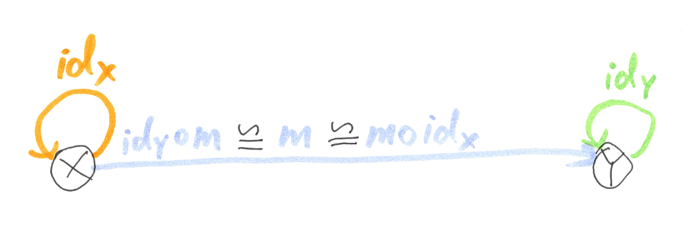

origin: https://weblogs.asp.net/dixin/category-theory-via-csharp-1-fundamentals

# 기초

범주론은 1940년대에 Samuel Eilenberg와 Saunders Mac Lane이 처음 도입 한 수학의 추상 구조와 관계를 설명하는 이론적 기반이로 그것은 수학적 개념과 속성을 항목의 모임과 관계를 형식화 한 추상적인 방법으로 검증합니다.

범주론은 추상이며 Norman Steenrod에 의해 `general abstract nonsense`로 불리게 됬다, 또한 일반적이기 때문에 수학, 물리학 및 컴퓨터 과학 등 여러 분야에서 널리 적용된다. 프로그래밍에서 범주론은 타입과 함수의 대수적 이론이며 LINQ 및 모든 함수형 프로그래밍의 이론적 토대입니다.

이 장에서는 범주론과 범주, 사상, 자연 변환, 모노이드, 펑터 및 모나드 등을 포함한 핵샘 개념에 대해 이야기 합니다.

이런 일반적 추상 개념을 직관적 인 다이어그램과 C# 및 LINQ 예제를 통해 설명합니다. 이 지식은 C# 이나 다른 언어에서 함수형 프로그래밍에 대한 깊은 이해를 구축하는 데 도움이 되는데, 타입과 함수를 가진 모든 언어가 범주론적 구조이기 때문입니다.

# 범주와 범주 법칙

범주론에서 `범주 C`는 3가지 종류의 수학적 개체로 구성되어있는 대수적 구조이다:

- `ob(C)`로 표현되는 대상의 모임: 객체 지향 프로그래밍 패러다임의 대상(객체)가 아니다.
- `hom(C)`로 표현되는 대상 사이의 사상의 모임: 원본 대상 X에서 목표 대상 Y로의 사상 m은 `m: X → Y` 로 표현된다.
- `∘`로 표현되는 사상의 합성 연산: `m1 : X → Y, m2 : Y → Z` 에 대해 그 합성은 사상 `(m2 ∘ m1) : X → Z` 이 된다.

> 참고: https://ko.wikipedia.org/wiki/%EB%B2%94%EC%A3%BC_(%EC%88%98%ED%95%99)


그리고 그 개체들은 다음의 2가지의 범주 법칙을 충족시켜야한다:

- 결합 법칙: `m1: W → X, m2: X → Y, m3: Y → Z` 에 대해 `(m3 ∘ m2) ∘ m1 ≡ m3 ∘ (m2 ∘ m1)`을 만족해야 한다.


- 항등 법칙: 각 대상 X에 대해 항등 사상: `idX: X → X`이 존재하고 항등 사상은 사상 합성에 중립적이다(e.g `1+0=1` 에서 `0`은 `+` 연산에 중립적이다). `m: X → Y`에 대해 `idY ∘ m ≡ m ≡ m ∘ idX`을 만족해야 한다.

> `≡`: 항등, 합동, 정의를 의미하는 수학 기호



위의 추상적 정의를 직관적으로 만들기 위해, 범주는 다음과 같은 인터페이스로 표현할 수 있다:

``` csharp
public interface ICategory<TObject, TMorphism>
{
    IEnumerable<TObject> Objects { get; }

    TMorphism Compose(TMorphism morphism2, TMorphism morphism1);

    TMorphism Id(TObject @object);
}
```

범주의 간단한 예는 대상의 모임이 모두 정수이고 사상들의 모임은 정수에서 그 자신 또는 그보다 크거나 같은 다른 정수에 ≤(작거나 같음) 관계인 `정수의 범주`이다. 예를 들면 `m1: 0 → 1 (0 ≤ 1)`이 된다.

부분 부등호 전이(A, B, C가 있을 때 A ≤ B이고 B ≤ C라면 A ≤ C가 성립)에 대해서 ≤ 사상은 합성할 수 있다. 예를 들어 `m1: 0 → 1 (0 ≤ 1), m2: 1 → 10 (1 ≤ 10)`는 사상 `(m2 ∘ m1): 0 → 10 (0 ≤ 10)`로 합성할 수 있다.


명백하게 위의 합성은 결합적이다. 예를 들면 `"((1 ≤ 10) ∘ (0 ≤ 1)) ∘ (-1 ≤ 0)" ≡ "-1 ≤ 10" ≡ "(1 ≤ 10) ∘ ((0 ≤ 1) ∘ (-1 ≤ 0))"`이 된다.

그리고 각각의 정수 X에 대해 항등 사상은 `idX: X → X (X ≤ X)`이 되고 이는 `"(Y ≤ Y) ∘ (X ≤ Y)" ≡ "X ≤ Y" ≡ "(X ≤ Y) ∘ (X ≤ X)"`이 된다.

따라서 범주 법칙을 만족한다.

C#에서 정수는 int로 표현할 수 있고 `≤ 관계`의 사상은 BinaryExpression의 노드 타입 LessThanOrEqual으로 표현될 수 있으므로 범주는 다음과 같이 표현할 수 있다:

> 참고: [C# 식 트리](https://docs.microsoft.com/ko-kr/dotnet/csharp/programming-guide/concepts/expression-trees/)

``` csharp
public class Int32Category : ICategory<int, BinaryExpression>
{
    public IEnumerable<int> Objects
    {
        get
        {
            for (int int32 = int.MinValue; int32 <= int.MaxValue; int32++)
            {
                yield return int32;
            }
        }
    }

    public BinaryExpression Compose(BinaryExpression morphism2, BinaryExpression morphism1) =>
        Expression.LessThanOrEqual(morphism2.Left, morphism1.Right); // (Y <= Z) ∘ (X <= Y) => X <= Z.

    public BinaryExpression Id(int @object) =>
        Expression.LessThanOrEqual(Expression.Constant(@object), Expression.Constant(@object)); // X <= X.
}
```

# DotNet 범주

.NET은 또한 DotNet이라는 타입과 함수의 범주로 볼 수 있다:

- `ob(DotNet)`: DotNet 범주에서 대상의 모임은 `string(System.String)`, `int(System.Int32)`, `bool(System.Boolean)` 등과 같은 `.NET` 타입들 이다.
- `hom(DotNet)`: DotNet 범주에서 사상의 모임은 `int.Parse: string → int`, `DateTime.IsLeapYear: int → bool` 등과 같은 입력 타입(원본 대상)과 출력 타입(목표 대상) 사이의 순수 함수들이다.
- `∘`: DotNet 범주에서 사상 합성 연산은 함수들의 합성이다.

합수 합성은 결합적이고 단위 함수 `Id`는 항등 사상이다:

``` csharp
public static partial class Functions
{
    public static Func<TSource, TResult> o<TSource, TMiddle, TResult>(
        this Func<TMiddle, TResult> function2, Func<TSource, TMiddle> function1) =>
            value => function2(function1(value));

    public static TSource Id<TSource>(TSource value) => value;
}
```

따라서 범주 법칙을 만족한다.


DotNet 범주는 다음과 같이 표현할 수 있다:

``` csharp
public partial class DotNetCategory : ICategory<Type, Delegate>
{
    public IEnumerable<Type> Objects =>
        SelfAndReferences(typeof(DotNetCategory).Assembly)
            .SelectMany(assembly => assembly.GetExportedTypes());

    public Delegate Compose(Delegate morphism2, Delegate morphism1) =>
        // return (Func<TSource, TResult>)Functions.Compose<TSource, TMiddle, TResult>(
        //    (Func<TMiddle, TResult>)morphism2, (Func<TSource, TMiddle>)morphism1);
        (Delegate)typeof(Linq.FuncExtensions).GetMethod(nameof(Linq.FuncExtensions.o))
            .MakeGenericMethod( // TSource, TMiddle, TResult.
                morphism1.Method.GetParameters().Single().ParameterType,
                morphism1.Method.ReturnType,
                morphism2.Method.ReturnType)
            .Invoke(null, new object[] { morphism2, morphism1 });

    public Delegate Id(Type @object) => // Functions.Id<TSource>
        typeof(Functions).GetMethod(nameof(Functions.Id)).MakeGenericMethod(@object)
            .CreateDelegate(typeof(Func<,>).MakeGenericType(@object, @object));

    private static IEnumerable<Assembly> SelfAndReferences(
        Assembly self, HashSet<Assembly> selfAndReferences = null)
    {
        selfAndReferences = selfAndReferences ?? new HashSet<Assembly>();
        if (selfAndReferences.Add(self))
        {
            self.GetReferencedAssemblies().ForEach(reference => 
                SelfAndReferences(Assembly.Load(reference), selfAndReferences));
            return selfAndReferences;
        }
        return Enumerable.Empty<Assembly>(); // Circular or duplicate reference.
    }
}
```

DotNet 범주에서 각 대상은 `System.Type`으로 표현되는 타입이므로 `Objects` 메서드는 현재 assembly와 모든 참조 assembly에서 유효한 모든 타입을 재귀적으로 쿼리합니다.

그리고 각 사상은 `System.Delegate`로 표현할 수있는 어떤 타입을 받고 다른 타입으로 돌려주는 함수이며 합성은 2개의 `Delegate` 인스턴스에 대해 `∘` 연산자를 호출하는 것입니다.