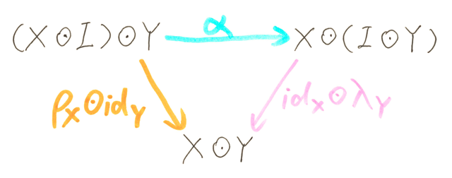
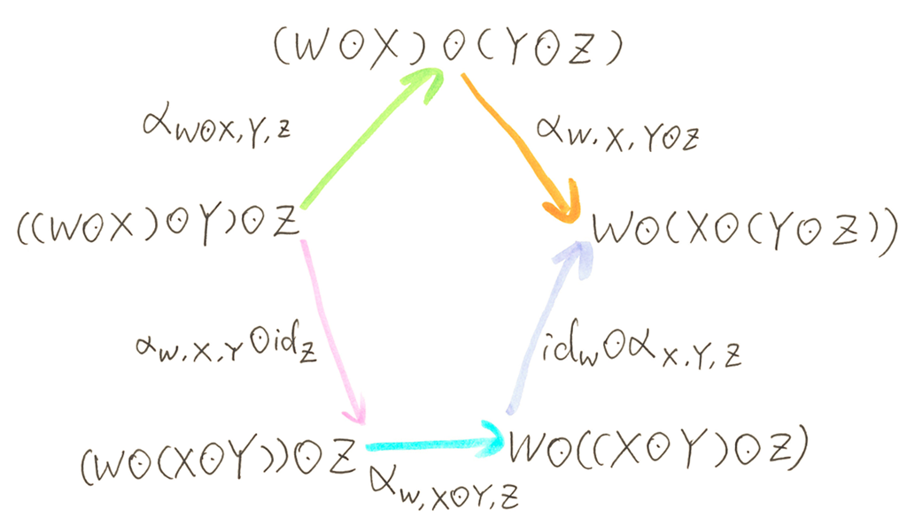

# Monoid and monoid laws

origin: https://weblogs.asp.net/dixin/category-theory-via-csharp-2-monoid

Monoid is an important algebraic structure in category theory. A monoid M is a set M equipped with a binary operation ⊙ and a special element I, denoted 3-tuple (M, ⊙, I), where

- M is a set of elements
- ⊙ is a binary operator called multiplication, so that M ⊙ M → M, which means the multiplication of 2 elements in set M always results an element in set M. This operation is also denoted μ, so that μ(M, M) ≡ M ⊙ M.
- I is a special unit element (aka neutral element, or identity element) in set M

And the binary operator and the unit element must satisfy the following monoid laws:

- associative law αX, Y, Z: (X ⊙ Y) ⊙ Z ≡ X ⊙ (Y ⊙ Z), where X ∈ M, Y ∈ M, Z ∈ M
- left unit law λX: I ⊙ X ≡ X, where X ∈ M; and right unit law ρX: X ≡ X ⊙ I, where X ∈ M

so that:

- the triangle identity commutes:



- and the pentagon identity commutes::



In C#, the monoid definition can be represented as:

``` charp
public interface IMonoid<T>
{
    T Multiply(T value1, T value2);

    T Unit();
}
```

An intuitive example is the set ℤ of all integers, with binary operator + and unit element 0. The addition of 2 integers always results another integer; Also for integers x, y ,z, there is (x + y) + z ≡ x + (y + z) and 0 + x ≡ x ≡ x + 0 (ℤ, +, 0), so that (ℤ, +, 0) is monoid. Apparently (ℤ, *, 1) is monoid too.

``` csharp
public class Int32SumMonoid : IMonoid<int>
{
    public int Multiply(int value1, int value2) => value1 + value2;

    public int Unit() => 0;
}

public class Int32ProductMonoid : IMonoid<int>
{
    public int Multiply(int value1, int value2) => value1 * value2;

    public int Unit() => 1;
}
```

Another monoid example is (string, string.Concat, string.Empty):

``` csharp
public class StringConcatMonoid : IMonoid<string>
{
    public string Multiply(string value1, string value2) => string.Concat(value1, value2);

    public string Unit() => string.Empty;
}
```

Here string can be viewed as a sequence of char, and the unit string is an empty sequence. Generally, (IEnumerable<T>, Enumerable.Concat<T>, Enumerable.Empty<T>()) is a monoid:

``` csharp
public class EnumerableConcatMonoid<T> : IMonoid<IEnumerable<T>>
{
    public IEnumerable<T> Multiply(IEnumerable<T> value1, IEnumerable<T> value2) => value1.Concat(value2);

    public IEnumerable<T> Unit() => Enumerable.Empty<T>();
}
```

The set of Boolean values { true, false }, with binary operator && and unit element true, is a monoid with only 2 element: ({true, false}, &&, true); And so is ({ true, false }, ||, false):

``` csharp
public class BooleanAndMonoid : IMonoid<bool>
{
    public bool Multiply(bool value1, bool value2) => value1 && value2;

    public bool Unit() => true;
}

public class BooleanOrMonoid : IMonoid<bool>
{
    public bool Multiply(bool value1, bool value2) => value1 || value2;

    public bool Unit() => false;
}
```

A monoid with 1 single element can be defined with the special type void (System.Void):

``` csharp
namespace System
{
    [ComVisible(true)]
    [Serializable]
    [StructLayout(LayoutKind.Sequential, Size = 1)]
    public struct Void
    {
    }
}
```

The set { default(void) } with the following operator and unit is a monoid:

``` csharp
public class VoidMonoid : IMonoid<void>
{
    public void Multiply(void value1, void value2) => default;

    public void Unit() => default;
}
```

However, C# compiler does not allow void keyword or System.Void type to be used in this way, so here System.Void can be replaced with its equivalency in F#, the Microsoft.FSharp.Core.Unit type:

``` csharp
namespace Microsoft.FSharp.Core
{
    [CompilationMapping(SourceConstructFlags.ObjectType)]
    [Serializable]
    public sealed class Unit : IComparable
    {
        internal Unit() { }

        public override int GetHashCode() => 0;

        public override bool Equals(object obj) => 
            obj == null || LanguagePrimitives.IntrinsicFunctions.TypeTestGeneric<Unit>(obj);

        int IComparable.CompareTo(object obj) => 0;
    }
}
```

With an internal constructor, Unit cannot be instantiated, a Unit variable can only be default(Unit), which is null. So similarly, set { default(Unit) } with the following operator and unit element is monoid:

``` csharp
public class UnitMonoid : IMonoid<Unit>
{
    public Unit Multiply(Unit value1, Unit value2) => null;

    public Unit Unit() => null;
}
```

# Monoid as category

An individual monoid (M, ⊙, I) can be a category C with 1 single object M, where:

- The collection of objects ob(C) is { M }, which means, category C has 1 single object, that is M.
- The collection of orphisms hom(C) is set M itself, which mean, each elements in set M is a morphism in category C.
- The composition operation ∘ of C is ⊙: since each morphism in C is each element in M, the composition of morphisms is just the multiplication of elements.
- The identity morphism id of C is unit element I: the identity morphism in C is the unit element in M

In this way, since M, ⊙, I satisfies the monoid laws, apparently the category laws are satisfied. In C#, this singleton category can be represented as:

``` csharp
public class MonoidCategory<T> : ICategory<Type, T>
{
    private readonly IMonoid<T> monoid;

    public MonoidCategory(IMonoid<T> monoid)
    {
        this.monoid = monoid;
    }

    public IEnumerable<Type> Objects { get { yield return typeof(T); } }

    public T Compose(T morphism2, T morphism1) => this.monoid.Multiply(morphism1, morphism2);

    public T Id(Type @object) => this.monoid.Unit;
}
```