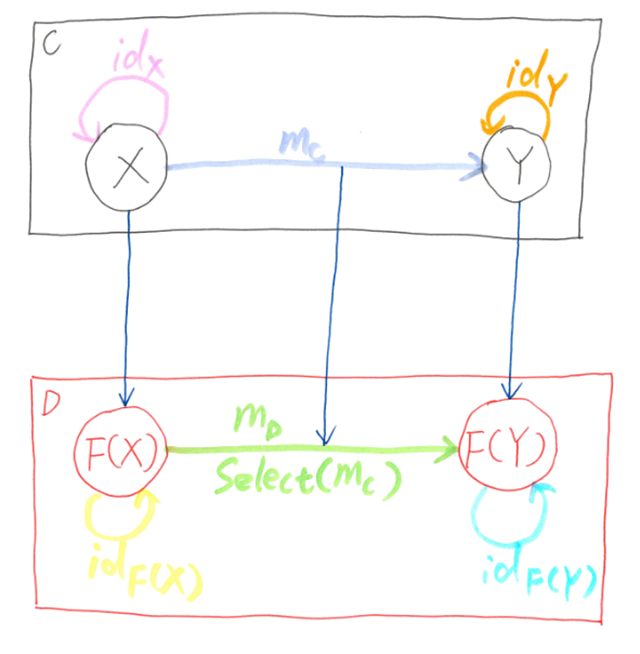
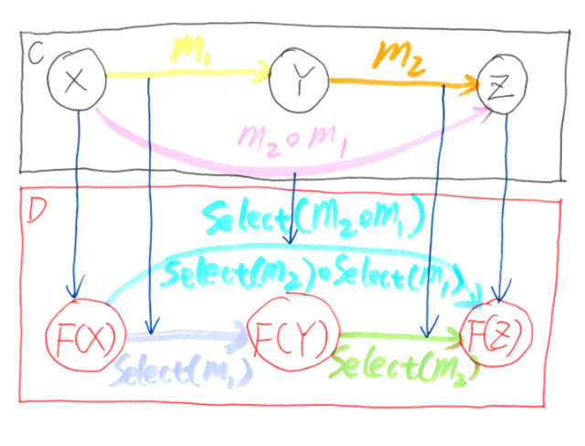

origin: https://weblogs.asp.net/dixin/category-theory-via-csharp-3-functor-and-linq-to-functors

# 펑터와 LINQ to 펑터

## 펑터와 펑터 법칙

밤주론에서 펑터는 범주에서 범주로의 맵핑을 의미합니다. 범주 `C`와 `D`가 주어졌을 때, 펑터 F는 `F: C -> D` 로 표현되는 `C`에서 `D`로의 구조보존 사상이 됩니다.



- `F`는 `C`의 대상들을 `D`의 대상으로 `매핑`합니다, 예를 들어서 `X, Y, Z, ... ∈ ob(C)`는 `F(X), F(Y), F(Z), … ∈ ob(D)`로 매핑됩니다.
- `F`는 또한 `C`에서의 사상에서 `D`에서의 사상을 맵핑합니다. 예를 들어서 `m: X → Y ∈ hom(C)`는 사상 `F(m): F(X) → F(Y) ∈ hom(D)`로 맵핑됩니다. 이 튜토리얼에서는 `C#/.NET` 용어에 맞추기 위해 펑터의 이 사상 맵핑을 능력을 `select`라고 부르기로 한다. 또한 `F(m)`은 `SelectF(m)`으로 표시한다.

> 맵핑: https://ko.wikipedia.org/wiki/%EB%A7%B5%ED%95%91_(%EC%88%98%ED%95%99)

그리고 `F`는 다음의 `펑터 법칙`을 반드시 만족해야한다:

- Composition preservation: F(m2 ∘ m1) ≡ F(m2) ∘ F(m1), or SelectF(m2 ∘ m1) ≡ SelectF(m2) ∘ SelectF(m1), F maps composition in C to composition in D
- 구성 보존: `C`에서의 구성에서   `F(m2 ∘ m1) ≡ F(m2) ∘ F(m1)` 또는 `SelectF(m2 ∘ m1) ≡ SelectF(m2) ∘ SelectF(m1)`, `F` maps composition in `C` to composition in `D`

- Identity preservation: F(idX) ≡ idF(X), or SelectF(idX) ≡ idF(X), F maps each identity morphism in C to identity morphism in D



### Endofunctor

When a functor F’s source category and target category are the same category C, it is called endofunctor, denoted F: C → C. In the DotNet category, there are endofunctors mapping objects (types) and morphisms (functions) in DotNet category to other objects and morphisms in itself. In C#, endofunctor in DotNet can be defined as:

``` csharp
// Cannot be compiled.
public interface IFunctor<TFunctor<>> where TFunctor<> : IFunctor<TFunctor>
{
    Func<TFunctor<TSource>, TFunctor<TResult>> Select<TSource, TResult>(Func<TSource, TResult> selector);
}
```

In DotNet category, objects are types, so the functor’s type mapping capability is represented by generic type TFunctor<>, which maps type T to another type TFunctor<T>. And in DotNet category, morphisms are functions, so the functor’s function mapping capability is represented by the Select method, which maps function of type TSource –> TResult to another function of type TFunctor<TSource> –> TFunctor<TResult>.

Unfortunately, the above interface cannot be compiled, because C#/.NET do not support higher-kinded polymorphism for types.

### Type constructor and higher-kinded type

Kind is the meta type of a type:

- A concrete type has the simplest kind, denoted *. All non generic types (types without type parameters) are of kind *. Closed generic types (types with concrete type arguments) are also concrete types of kind *.
- An open generic type definition with type parameter can be viewed as a type constructor, which works like a function. For example,  IEnumerable<> can accept a type of kind * (like int), and return another closed type of kind * (like IEnumerable<int>), so IEnumerable<> is a type constructor, its kind is denoted * –> *; ValueTuple<,> can accept 2 types of kind * (like string and bool), and return another closed type of kind * (like ValueTuple<string, bool>) so ValueTuple<,> is a type constructor, its kind is denoted (*, *) –> *, or * –> * –> * in curried style.

In above IFunctor<TFunctor<>> generic type definition, its type parameter TFunctor<> is an open generic type of kind * –> *. As a result, IFunctor<TFunctor<>> can be viewed as a type constructor, which works like a higher-order function, accepting a TFunctor<> type constructor of kind * –> *, and returning a concrete type of kind *. So  IFunctor<TFunctor<>> is of kind (* –> *) –> *. This is called a higher-kinded type, and not supported by .NET and C# compiler. In another word, C# generic type definition does not support its type parameter to have type parameters. In C#, functor support is implemented by LINQ query comprehensions instead of type system.

## LINQ to Functors

### Built-in IEnumerable<> functor

IEnumerable<> is a built-in functor of DotNet category, which can be viewed as virtually implementing above IFunctor<TFunctor<>> interface:

``` csharp
public interface IEnumerable<T> : IFunctor<IEnumerable<>>, IEnumerable
{
    // Func<IEnumerable<TSource>, IEnumerable<TResult>> Select<TSource, TResult>(Func<TSource, TResult> selector);

    // Other members.
}
```

Endofunctor IEnumerable<> in DotNet category maps each T object (type) to IEnumerable<T> object (type), and its Select method maps TSource→ TResult morphism (function) to IEnumerable<TSource> → IEnumerable<TResult> morphism (function). So its Select method is of type (TSource –> TResult) –> (IEnumerable<TSource> –> IEnumerable<TResult>), which can be uncurried to (TSource –> TResult, IEnumerable<TSource>) –> IEnumerable<TResult>:

``` csharp
public interface IEnumerable<T> : IFunctor<IEnumerable<T>>, IEnumerable
{
    // Func<IEnumerable<TSource>, IEnumerable<TResult>> Select<TSource, TResult>(Func<TSource, TResult> selector);
    // can be equivalently converted to:
    // IEnumerable<TResult> Select<TSource, TResult>(Func<TSource, TResult> selector, IEnumerable<TSource> source);

    // Other members.
}
```

Now swap the 2 parameters of the uncurried Select, then its type becomes (IEnumerable<TSource>, TSource –> TResult) –> IEnumerable<TResult>:

``` csharp
public interface IEnumerable<T> : IFunctor<IEnumerable<T>>, IEnumerable
{
    // Func<IEnumerable<TSource>, IEnumerable<TResult>> Select<TSource, TResult>(Func<TSource, TResult> selector);
    // can be equivalently converted to:
    // IEnumerable<TResult> Select<TSource, TResult>(IEnumerable<TSource> source, Func<TSource, TResult> selector);

    // Other members.
}
```

In .NET, this equivalent version of Select is exactly the LINQ query method Select. The following is the comparison of functor Select method and LINQ Select method:

``` csharp
public static partial class EnumerableExtensions // IEnumerable<T> : IFunctor<IEnumerable<>>
{
    // Functor Select: (TSource -> TResult) -> (IEnumerable<TSource> -> IEnumerable<TResult>).
    public static Func<IEnumerable<TSource>, IEnumerable<TResult>> Select<TSource, TResult>(
        Func<TSource, TResult> selector) => source => 
            Select(source, selector);

    // 1. Uncurry to Select: (TSource -> TResult, IEnumerable<TSource>) -> IEnumerable<TResult>.
    // 2. Swap 2 parameters to Select: (IEnumerable<TSource>, TSource -> TResult) -> IEnumerable<TResult>.
    // 3. Define as LINQ extension method.
    public static IEnumerable<TResult> Select<TSource, TResult>(
        this IEnumerable<TSource> source, Func<TSource, TResult> selector)
    {
        foreach (TSource value in source)
        {
            yield return selector(value);
        }
    }
}
```

So the IEnumerable<> functor’s morphism mapping capability is implemented as the LINQ mapping query. As a part of the LINQ query expression pattern, functor support is built in in the C# language:

``` csharp
internal static void Map()
{
    IEnumerable<int> source = System.Linq.Enumerable.Range(0, 5);
    // Map int to string.
    Func<int, string> selector = Convert.ToString;
    // Map IEnumerable<int> to IEnumerable<string>.
    IEnumerable<string> query = from value in source
                                select selector(value); // Define query.
    query.WriteLines(); // Execute query.
}
```

And the above Select implementation satisfies the functor laws:

``` csharp
// using static Dixin.Linq.CategoryTheory.Functions;
internal static void FunctorLaws()
{
    IEnumerable<int> source = new int[] { 0, 1, 2, 3, 4 };
    Func<int, double> selector1 = int32 => Math.Sqrt(int32);
    Func<double, string> selector2 = @double => @double.ToString("0.00");

    // Associativity preservation: source.Select(selector2.o(selector1)) == source.Select(selector1).Select(selector2).
    (from value in source
        select selector2.o(selector1)(value)).WriteLines();  // 0.00 1.00 1.41 1.73 2.00
    (from value in source
        select selector1(value) into value
        select selector2(value)).WriteLines();  // 0.00 1.00 1.41 1.73 2.00
    // Identity preservation: source.Select(Id) == Id(source).
    (from value in source
        select Id(value)).WriteLines(); // 0 1 2 3 4
    Id(source).WriteLines(); // 0 1 2 3 4
}
```

### Functor pattern of LINQ

So LINQ Select mapping query’s quintessential mathematics is functor. Generally, in DotNet category, a type is a functor if:

- This type is an open generic type definition, which can be viewed as type constructor of kind * –> *, so that it maps a concrete type T to another concrete functor-wrapped type.
- It is equipped with the standard LINQ query method Select, which can be either instance method or extension method.
- The implementation of Select satisfies the functor laws, so that DotNet category’s associativity law and identity law are preserved.

On the other hand, to enable the LINQ functor query expression (single from clauses with select clause) for a type does not require that type to be strictly a functor. This LINQ syntax can be enabled for any generic or non generic type with as long as it has such a Select method, , which can be virtually demonstrated as:

``` csharp
// Cannot be compiled.
internal static void Map<TFunctor<>, TSource, TResult>( // Non generic TFunctor can work too.
    TFunctor<TSource> functor, Func<TSource, TResult> selector) where TFunctor<> : IFunctor<TFunctor<>>
{
    TFunctor<TResult> query = from /* TSource */ value in /* TFunctor<TSource> */ functor
                              select /* TResult */ selector(value); // Define query.
}
```

## More LINQ to Functors

Many other open generic type definitions provided by .NET can be functor. Take Lazy<> as example, first, apparently it is a type constructor of kind * –> *. Then, its Select query method can be defined as extension method:

``` csharp
public static partial class LazyExtensions // Lazy<T> : IFunctor<Lazy<>>
{
    // Functor Select: (TSource -> TResult) -> (Lazy<TSource> -> Lazy<TResult>)
    public static Func<Lazy<TSource>, Lazy<TResult>> Select<TSource, TResult>(
        Func<TSource, TResult> selector) => source =>
            Select(source, selector);

    // LINQ Select: (Lazy<TSource>, TSource -> TResult) -> Lazy<TResult>
    public static Lazy<TResult> Select<TSource, TResult>(
        this Lazy<TSource> source, Func<TSource, TResult> selector) =>
            new Lazy<TResult>(() => selector(source.Value));

    internal static void Map()
    {
        Lazy<int> source = new Lazy<int>(() => 1);
        // Map int to string.
        Func<int, string> selector = Convert.ToString;
        // Map Lazy<int> to Lazy<string>.
        Lazy<string> query = from value in source
                             select selector(value); // Define query.
        string result = query.Value; // Execute query.
    }
}
```

Func<> with 1 type parameter is also a functor with the following Select implementation:

``` csharp
public static partial class FuncExtensions // Func<T> : IFunctor<Func<>>
{
    // Functor Select: (TSource -> TResult) -> (Func<TSource> -> Func<TResult>)
    public static Func<Func<TSource>, Func<TResult>> Select<TSource, TResult>(
        Func<TSource, TResult> selector) => source =>
            Select(source, selector);

    // LINQ Select: (Func<TSource>, TSource -> TResult) -> Func<TResult>
    public static Func<TResult> Select<TSource, TResult>(
        this Func<TSource> source, Func<TSource, TResult> selector) =>
            () => selector(source());

    internal static void Map()
    {
        Func<int> source = () => 1;
        // Map int to string.
        Func<int, string> selector = Convert.ToString;
        // Map Func<int> to Func<string>.
        Func<string> query = from value in source
                             select selector(value); // Define query.
        string result = query(); // Execute query.
    }
}
```

Here Select maps TSource –> TResult function to Func<TSource> –> Func<TResult> function, which is straightforward. The other Func generic delegate types, like Func<,> with 2 type parameters, could be more interesting. Just like fore mentioned ValueTuple<,>, Func<,> is of kind * –> * –> *, and can be viewed as a type constructor accepting 2 concrete types and returning another concrete type, which is different from functor. However, if Func<,> already has a concrete type T as its first type parameter, then Func<T,> can be viewed as a partially applied type constructor of kind * –> *, which can map one concrete type (its second type parameter) to another concrete type. So that Func<T,> is also a functor, with the following Select method:

``` csharp
public static partial class FuncExtensions // Func<T, TResult> : IFunctor<Func<T,>>
{
    // Functor Select: (TSource -> TResult) -> (Func<T, TSource> -> Func<T, TResult>)
    public static Func<Func<T, TSource>, Func<T, TResult>> Select<T, TSource, TResult>(
        Func<TSource, TResult> selector) => source =>
            Select(source, selector);

    // LINQ Select: (Func<T, TSource>, TSource -> TResult) -> Func<T, TResult>
    public static Func<T, TResult> Select<T, TSource, TResult>(
        this Func<T, TSource> source, Func<TSource, TResult> selector) =>
            value => selector(source(value)); // selector.o(source);
}
```

This time Select maps TSource –> TResult function to Func<T, TSource> –> Func<T, TResult> function. Actually, Func<T,> functor’s Select is exactly the function composition:

``` csharp
internal static void Map<T>(T input)
{
    Func<T, string> source = value => value.ToString();
    // Map string to bool.
    Func<string, bool> selector = string.IsNullOrWhiteSpace;
    // Map Func<T, string> to Func<T, bool>.
    Func<T, bool> query = from value in source
                          select selector(value); // Define query.
    bool result = query(input); // Execute query.

    // Equivalent to:
    Func<T, string> function1 = source;
    Func<string, bool> function2 = selector;
    Func<T, bool> composition = function2.o(function1);
    result = composition(input);
}
```

ValueTuple<> with 1 type parameter simply wraps a value. It is the eager version of Lazy<>, and it is also functor, with the following Select method:

``` csharp
public static partial class ValueTupleExtensions // ValueTuple<T> : IFunctor<ValueTuple<>>
{
    // Functor Select: (TSource -> TResult) -> (ValueTuple<TSource> -> ValueTuple<TResult>)
    public static Func<ValueTuple<TSource>, ValueTuple<TResult>> Select<TSource, TResult>(
        Func<TSource, TResult> selector) => source =>
            Select(source, selector); // Immediate execution.

    // LINQ Select: (ValueTuple<TSource>, TSource -> TResult) -> ValueTuple<TResult>
    public static ValueTuple<TResult> Select<TSource, TResult>(
        this ValueTuple<TSource> source, Func<TSource, TResult> selector) =>
            new ValueTuple<TResult>(selector(source.Item1)); // Immediate execution.
}
```

Unlike all the previous Select, here ValueTuple<>’s Select query method cannot implement deferred execution. To construct a ValueTuple<TResult> instance and return, selector must be called immediately to evaluate the result value.

``` csharp
internal static void Map()
{
    ValueTuple<int> source = new ValueTuple<int>(1);
    // Map int to string.
    Func<int, string> selector = int32 =>
        {
            $"{nameof(selector)} is called with {int32}.".WriteLine();
            return Convert.ToString(int32);
        };
    // Map ValueTuple<int> to ValueTuple<string>.
    ValueTuple<string> query = from value in source // Define and execute query.
                                select selector(value); // selector is called with 1.
    string result = query.Item1; // Query result.
}
```

Similar to Func<T,>, ValueTuple<T,> is also functor, with the following Select method of immediate execution:

``` csharp
public static partial class ValueTupleExtensions // ValueTuple<T, T2> : IFunctor<ValueTuple<T,>>
{
    // Functor Select: (TSource -> TResult) -> (ValueTuple<T, TSource> -> ValueTuple<T, TResult>)
    public static Func<(T, TSource), (T, TResult)> Select<T, TSource, TResult>(
        Func<TSource, TResult> selector) => source =>
            Select(source, selector); // Immediate execution.

    // LINQ Select: (ValueTuple<T, TSource>, TSource -> TResult) -> ValueTuple<T, TResult>
    public static (T, TResult) Select<T, TSource, TResult>(
        this(T, TSource) source, Func<TSource, TResult> selector) =>
            (source.Item1, selector(source.Item2)); // Immediate execution.

    internal static void Map<T>(T item1)
    {
        (T, int) source = (item1, 1);
        // Map int to string.
        Func<int, string> selector = int32 =>
        {
            $"{nameof(selector)} is called with {int32}.".WriteLine();
            return Convert.ToString(int32);
        };
        // Map ValueTuple<T, int> to ValueTuple<T, string>.
        (T, string) query = from value in source // Define and execute query.
                            select selector(value); // selector is called with 1.
        string result = query.Item2; // Query result.
    }
}
```

Task is also an example of functor, with the following Select method:

``` csharp
public static partial class TaskExtensions // Task<T> : IFunctor<Task<>>
{
    // Functor Select: (TSource -> TResult) -> (Task<TSource> -> Task<TResult>)
    public static Func<Task<TSource>, Task<TResult>> Select<TSource, TResult>(
        Func<TSource, TResult> selector) => source =>
            Select(source, selector); // Immediate execution, impure.

    // LINQ Select: (Task<TSource>, TSource -> TResult) -> Task<TResult>
    public static async Task<TResult> Select<TSource, TResult>(
        this Task<TSource> source, Func<TSource, TResult> selector) =>
            selector(await source); // Immediate execution, impure.

    internal static async Task MapAsync()
    {
        Task<int> source = System.Threading.Tasks.Task.FromResult(1);
        // Map int to string.
        Func<int, string> selector = Convert.ToString;
        // Map Task<int> to Task<string>.
        Task<string> query = from value in source
                             select selector(value); // Define and execute query.
        string result = await query; // Query result.
    }
}
```

Similar to ValueTuple<>, above Select implementation is not deferred either. When Select is called, if the source task is already completed, the selector function is called immediately. And unlike all the previous Select methods are pure (referential transparent and side effect free), this Select use the await syntactic sugar to construct a state machine and start it immediately. So it changes state and is impure.

Nullable<> is also an interesting type. It is of kind * –> * and the following Select method can be defined:

``` csharp
public static partial class NullableExtensions // Nullable<T> : IFunctor<Nullable<>>
{
    // Functor Select: (TSource -> TResult) -> (Nullable<TSource> -> Nullable<TResult>)
    public static Func<TSource?, TResult?> Select2<TSource, TResult>(
        Func<TSource, TResult> selector) where TSource : struct where TResult : struct => source =>
            Select(source, selector); // Immediate execution.

    // LINQ Select: (Nullable<TSource>, TSource -> TResult) -> Nullable<TResult>
    public static TResult? Select<TSource, TResult>(
        this TSource? source, Func<TSource, TResult> selector) where TSource : struct where TResult : struct =>
            source.HasValue ? selector(source.Value) : default; // Immediate execution.

    internal static void Map()
    {
        long? source1 = 1L;
        // Map int to string.
        Func<long, TimeSpan> selector = TimeSpan.FromTicks;
        // Map Nullable<int> to Nullable<TimeSpan>.
        TimeSpan? query1 = from value in source1
                           select selector(value); // Define and execute query.
        TimeSpan result1 = query1.Value; // Query result.

        long? source2 = null;
        // Map Nullable<int> to Nullable<TimeSpan>.
        TimeSpan? query2 = from value in source2
                           select selector(value); // Define and execute query.
        bool result2 = query2.HasValue; // Query result.
    }
}
```

In the above Select method, if the source Nullable<TSource> instance represents an actual value of TSource, that value is extracted to call selector, and the result is wrapped into another Nullable<TResult> instance to return; if the source represents null, selector is not called, and a Nullable<TResult> instance representing null is directly returned. There are 2 issues here. First, Nullable<>’s type parameter is constrained to be structures, so it can only map some objects of DotNet category (the value types). Second, the Select implementation cannot be deferred. As LINQ query method, deferred execution is always preferred whenever possible. So the following Optional<T> type can be defined to be used with any type parameter, and also be lazy:

``` csharp
public readonly struct Optional<T>
{
    private readonly Lazy<(bool, T)> factory;

    public Optional(Func<(bool, T)> factory = null) =>
        this.factory = factory == null ? null : new Lazy<(bool, T)>(factory);

    public bool HasValue => this.factory?.Value.Item1 ?? false;

    public T Value
    {
        get
        {
            if (!this.HasValue)
            {
                throw new InvalidOperationException($"{nameof(Optional<T>)} object must have a value.");
            }
            return this.factory.Value.Item2;
        }
    }
}
```

Optional<T> is still a structure just like Nullable<T>, so its instance cannot be null. Its parameter is not constrained, so it can wrap any valid or invalid value of any type, Its constructor accepts a factory function just like Lazy<>, s the evaluation of its wrapped value can be deferred. And the factory function returns a tuple of bool value and T value, where the bool value indicates if the other T value is a valid value, and that bool value can be returned by the the HasValue property.

``` csharp
internal static void Optional()
{
    int int32 = 1;
    Func<int, string> function = Convert.ToString;

    Nullable<int> nullableInt32 = new Nullable<int>(int32);
    Nullable<Func<int, string>> nullableFunction = new Nullable<Func<int, string>>(function); // Cannot be compiled.
    Nullable<string> nullableString = new Nullable<string>(); // Cannot be compiled.

    Optional<int> optionalInt32 = new Optional<int>(() => (true, int32));
    Optional<Func<int, string>> optionalFunction = new Optional<Func<int, string>>(() => true, function));
    Optional<string> optionalString = new Optional<string>(); // Equivalent to: new Optional<string>(() => false, default);
}
```

Apparently, Optional<> is a factor, and its Select can be defined with deferred execution:

``` csharp
public static partial class OptionalExtensions // Optional<T> : IFunctor<Optional<>>
{
    // Functor Select: (TSource -> TResult) -> (Optional<TSource> -> Optional<TResult>)
    public static Func<Optional<TSource>, Optional<TResult>> Select<TSource, TResult>(
        Func<TSource, TResult> selector) => source =>
            Select(source, selector);

    // LINQ Select: (Optional<TSource>, TSource -> TResult) -> Optional<TResult>
    public static Optional<TResult> Select<TSource, TResult>(
        this Optional<TSource> source, Func<TSource, TResult> selector) =>
            new Optional<TResult>(() => source.HasValue
                ? (true, selector(source.Value)) : (false, default));

    internal static void Map()
    {
        Optional<int> source1 = new Optional<int>(() => (true, 1));
        // Map int to string.
        Func<int, string> selector = Convert.ToString;
        // Map Optional<int> to Optional<string>.
        Optional<string> query1 = from value in source1
                                    select selector(value); // Define query.
        if (query1.HasValue) // Execute query.
        {
            string result1 = query1.Value;
        }

        Optional<int> source2 = new Optional<int>();
        // Map Optional<int> to Optional<string>.
        Optional<string> query2 = from value in source2
                                    select selector(value); // Define query.
        if (query2.HasValue) // Execute query.
        {
            string result2 = query2.Value;
        }
    }
}
```

It is easy to verify all the above Select methods satisfy the functor laws. However, not any Select can automatically satisfy the functor laws. The following is a different Select implementation for Lazy<>:

``` csharp
public static Lazy<TResult> Select<TSource, TResult>(
    this Lazy<TSource> source, Func<TSource, TResult> selector) =>
        new Lazy<TResult>(() => default);
```

And it breaks the functor because it does not preserve the identity law:

``` csharp
internal static void FunctorLaws()
{
    Lazy<int> lazy = new Lazy<int>(() => 1);
    Func<int, string> selector1 = Convert.ToString;
    Func<string, double> selector2 = Convert.ToDouble;

    // Associativity preservation: TFunctor<T>.Select(f2.o(f1)) == TFunctor<T>.Select(f1).Select(f2)
    lazy.Select(selector2.o(selector1)).Value.WriteLine(); // 0
    lazy.Select(selector1).Select(selector2).Value.WriteLine(); // 0
    // Identity preservation: TFunctor<T>.Select(Id) == Id(TFunctor<T>)
    lazy.Select(Id).Value.WriteLine(); // 0
    Id(lazy).Value.WriteLine(); // 1
}
```